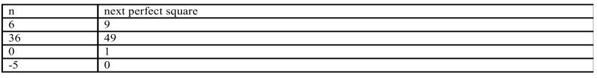
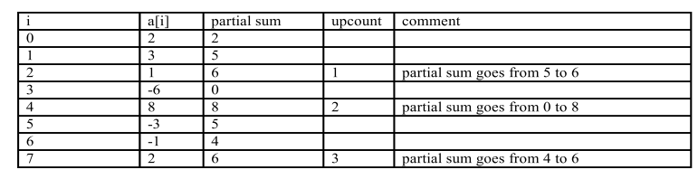

<b>QUESTION 1</b>
Write a function nextPerfectSquare that returns the first perfect square that is greater than
it's integer argument. A <b>perfect square</b> is an integer that is equal to some integer squared.For example 16 is a perfect square because 16 = 4*4. However 15 is not a perfect square because there is no integer n such that 15 = n*n.

The signature of the function is
int isPerfectSquare(int n)

<b><u>Example</u></b>  

----------------------------------------------------------------------------------------------
<b>QUESTION 2</b>
Define the n-upcount of an array to be the number of times the partial sum goes from less than
or equal to n to greater than n during the calculation of the sum of elements of the array.
if you are programming in Java or C#, the function signature is int nUpCount(int[] a, int n)

For example, if n=5, the 5-upcount of the array {2,3,1,-6,8,-3,-1,2} is 3.

