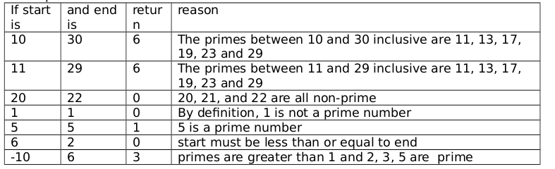

<b>QUESTION 1</b>  
Write a function named primeCount with signature <b>int primeCount(int start, int end);</b>
The function returns the number of primes between start and end inclusive. Recall that a prime is a positive integer greater than 1 whose only integer factors are 1 and itself.

<b><u>Example</u></b>  

----------------------------------------------------------------------------------------------

