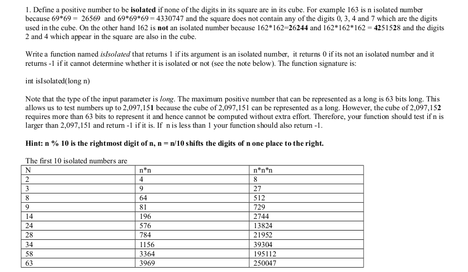
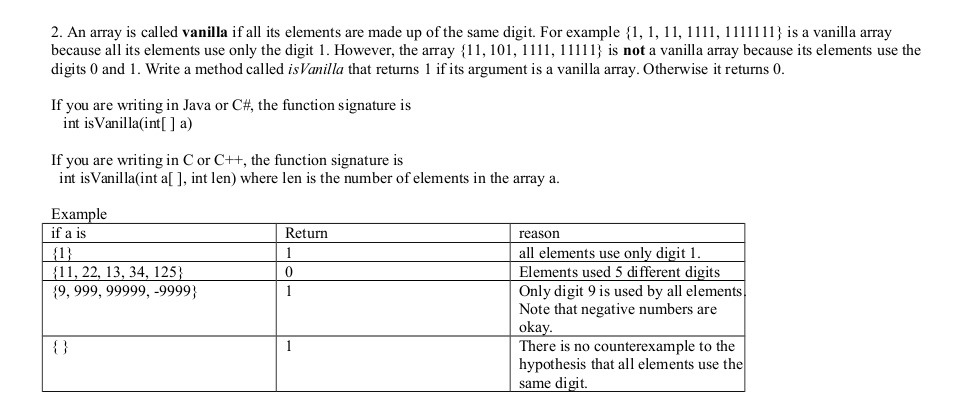
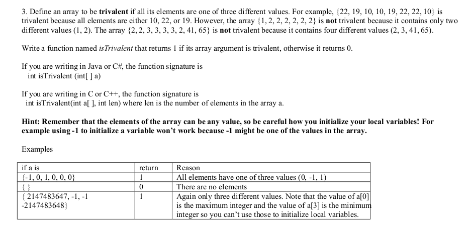

<b>QUESTION 1</b>  

 

----------------------------------------------------------------------------------------------
<b>QUESTION 2</b>  

-----------------------------------------------------------------------------------------------
<b>QUESTION 3</b>   

