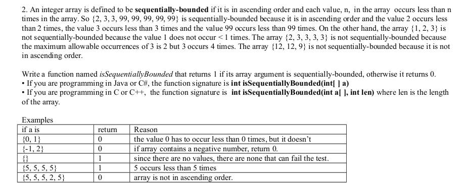
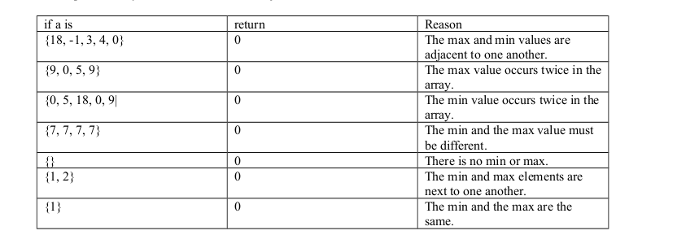

<b>QUESTION 1</b>  
Write a function named countRepresentations that returns the number of ways that an amount of money in rupees can be represented as rupee notes. For this problem we only use rupee notes in denominations of 1, 2, 5, 10 and 20 rupee notes.  
The signature of the function is:
<b>int countRepresentations(int numRupees)</b>

For example, countRepresentations(12) should return 15 because 12 rupees can be represented in the following 15 ways.
1. 12 one rupee notes2. 1 two rupee note plus 10 one rupee notes
3. 2 two rupee notes plus 8 one rupee notes
4. 3 two rupee notes plus 6 one rupee notes
5. 4 two rupee notes plus 4 one rupee notes
6. 5 two rupee notes plus 2 one rupee notes
7. 6 two rupee notes
8. 1 five rupee note plus 7 one rupee notes
9. 1 five rupee note, 1 two rupee note and 5 one rupee notes
10. 1 five rupee note, 2 two rupee notes and 3 one rupee notes
11. 1 five rupee note, 3 two notes and 1 one rupee note
12. 2 five rupee notes and 2 one rupee notes
13. 2 five rupee notes and 1 two rupee note
14. 1 ten rupee note and 2 one rupee notes
15. 1 ten rupee note and 1 two rupee not

 
Hint: Use a nested loop that looks like this. Please fill in the blanks intelligently, i.e. minimize the number of times that the if statement is executed.  
<t>for (int rupee20=0; rupee20<=__; rupee20++) 
    <t><t>for (int rupee10=0; rupee10<=__; rupee10++) 
       <t><t><t> for (int rupee5=0; rupee5<=__; rupee5++) 
          <t><t><t><t>  for (int rupee2=0; rupee2<=__; rupee2++) 
               <t><t><t><t><t> for (int rupee1=0; rupee1<=__; rupee1++) {
                            <t><t><t><t><t><t>if (___) 
                            <t><t><t><t><t><t>count++ 
                       <t><t><t><t><t> }

----------------------------------------------------------------------------------------------
<b>QUESTION 2</b>  

-----------------------------------------------------------------------------------------------
<b>QUESTION 3</b>  
An array is defined to be minmax-disjoint if the following conditions hold:
- The minimum and maximum values of the array are not equal.
- The minimum and maximum values of the array are not adjacent to one another.
- The minimum value occurs exactly once in the array.
- The maximum value occurs exactly once in the array.  
For example the array {5, 4, 1, 3, 2} is minmax-disjoint because
- The maximum value is 5 and the minimum value is 1 and they are not equal.
- 5 and 1 are not adjacent to one another
- 5 occurs exactly once in the array
- 2 occurs exactly once in the array  
Write a function named isMinMaxDisjoint that returns 1 if its array argument is minmax-disjoint, otherwise it returns 0.  

<b>Test Cases</b>  

