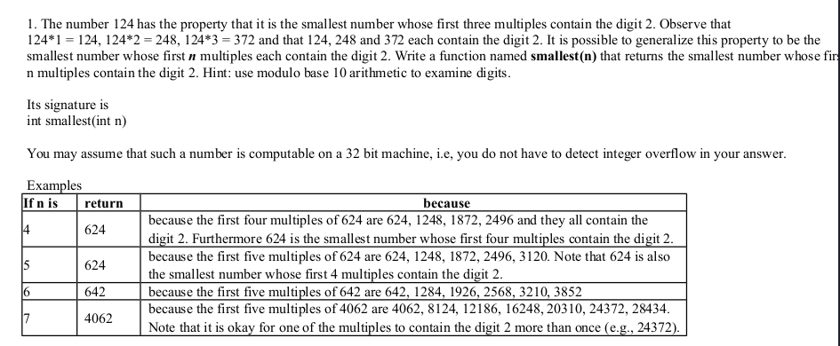
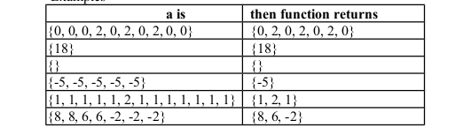

<b>QUESTION 1</b>  

----------------------------------------------------------------------------------------------
<b>QUESTION 2</b>  
Define a cluster in an integer array to be a maximum sequence of elements that are all the same value. For example, in the array {3, 3, 3, 4, 4, 3, 2, 2, 2, 2, 4} there are 5 clusters, {3, 3, 3}, {4, 4}, {3}, {2, 2, 2, 2} and {4}. A cluster-compression of an array replaces each cluster with the number that is repeated in the cluster. So, the cluster compression of the previous array would be {3, 4, 3, 2, 4}. The first cluster {3, 3, 3} is replaced by a single 3, and so on.   
Write a function named clusterCompression with the following signature <b>int[ ] clusterCompression(int[ ] a) </b>
 
The function returns the cluster compression of the array a. The length of the returned array must be equal to the number of clusters in the origin array! This means that someplace in your answer you must dynamically allocate the returned array.  
<b>Test Cases</b>  

-----------------------------------------------------------------------------------------------

