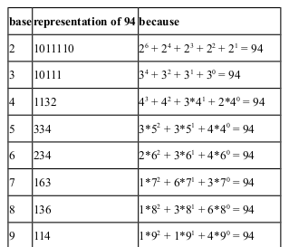
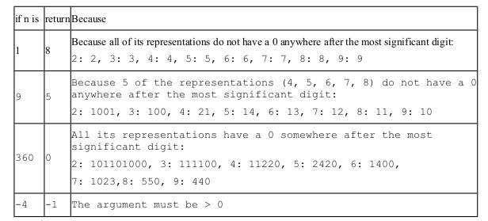
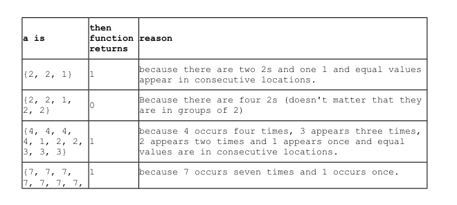

<b>QUESTION 1</b>  
Define the fullness quotient of an integer n > 0 to be the number of representations of n in bases 2 through 9 that have no zeroes anywhere after the most significant digit. For example, to see why the fullness quotient of 94 is 6 examine the following table which shows the representations of 94 in bases 2 through 9.  
 

Notice that the representations of 94 in base 2 and 3 both have 0s somewhere after the most significant digit, but the representations in bases 4, 5, 6, 7, 8, 9 do not. Since there are 6 such representations, the fullness quotient of 94 is 6.  
Write a method named fullnessQuotient that returns the fullness quotient of its argument. If the argument is less than 1 return -1. Its signature is <b> int fullnessQuotient(int n) </b>  
Hint: use modulo and integer arithmetic to convert n to its various representation

<b><u>Test cases: </u></b>  

----------------------------------------------------------------------------------------------
<b>QUESTION 2</b>  

Define an array to be packed if all its values are positive, each value n appears n
times and all equal values are in consecutive locations. So for example, {2, 2, 3, 3, 3}
is packed because 2 appears twice and 3 appears three times. But {2, 3, 2, 3, 3} is not
packed because the 2s are not in consecutive locations. And {2, 2, 2, 3, 3, 3} is not
packed because 2 appears three times.  

Write a method named isPacked that returns 1 if its array argument is packed, otherwise it
returns 0. You may assume that the array is not null. 

-----------------------------------------------------------------------------------------------