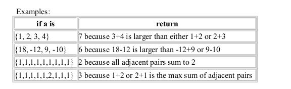

<b>QUESTION 1</b>  
Write a function named largestAdjacentSum that iterates through an array computing the sum of adjacent elements and returning the largest such sum. You may assume that the array has at least 2 elements.  

----------------------------------------------------------------------------------------------
