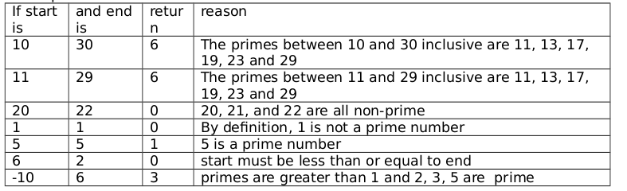
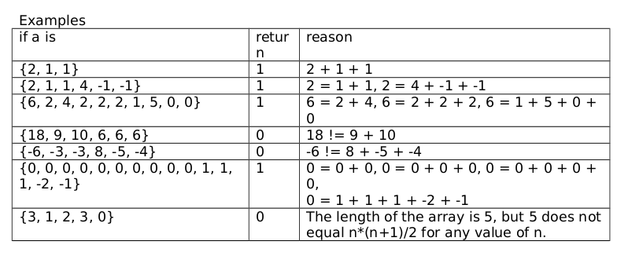
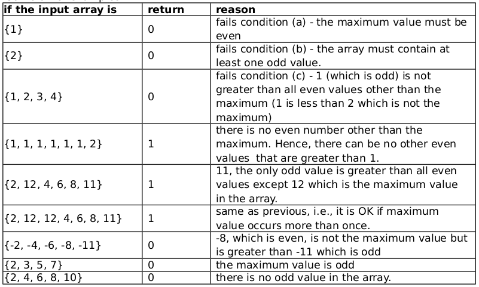

<b>QUESTION 1</b>  
Write a function named primeCount with signature <b>int primeCount(int start, int end);</b>
The function returns the number of primes between start and end inclusive. Recall that a prime is a positive integer greater than 1 whose only integer factors are 1 and itself.

<b><u>Example: </u></b>  

----------------------------------------------------------------------------------------------

<b>QUESTION 2</b>  
A Madhav array has the following property. a[0] = a[1] + a[2] = a[3] + a[4] + a[5] = a[6] + a[7] + a[8] + a[9] = ... The length of a Madhav array must be n*(n+1)/2 for some n.
Write a method named isMadhavArray that returns 1 if its array argument is a Madhav array,
otherwise it returns 0. 

<b><u>Example: </u></b>  

----------------------------------------------------------------------------------------------

<b>QUESTION 3</b>  
An array is defined to be inertial if the following conditions hold:
<ol>
<li> it contains at least one odd value </li>
<li>the maximum value in the array is even</li>
<li>every odd value is greater than every even value that is not the maximum value.</li>
</ol>
So {11, 4, 20, 9, 2, 8} is inertial because
<ul>
<li>it contains at least one odd value</li>
<li>the maximum value in the array is 20 which is even</li>
<li>the two odd values (11 and 9) are greater than all the even values that are not equal to 20 (the maximum), i.e., (4, 2, 8}. </li>
</ul>
However, {12, 11, 4, 9, 2, 3, 10} is not inertial because it fails condition (c), i.e., 10 (which is even) is greater 9 (which is odd) but 10 is not the maximum value in the array.

Write a function called isIntertial that accepts an integer array and returns 1 if the array is
inertial; otherwise it returns 0.

<b><u>Example: </u></b>  

