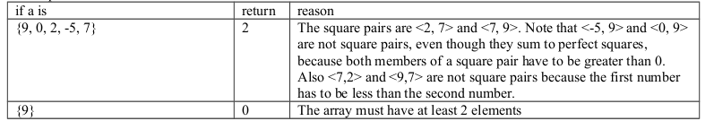
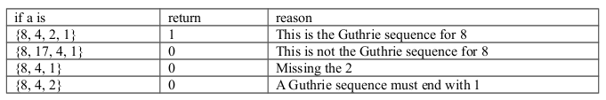

<b>QUESTION 1</b>  
Define a square pair to be the tuple <x, y> where x and y are positive, non-zero integers, x<\y and x + y is a perfect square. A perfect square is an integer whose square root is also an integer, e.g. 4, 9, 16 are perfect squares but 3, 10 and 17 are not. Write a function named countSquarePairs that takes an array and returns the number of square pairs that can be constructed from the elements in the array. For example, if the array is {11, 5, 4, 20} the function would return 3 because the only square pairs that can be constructed from
those numbers are <5, 11>, <5, 20> and <4, 5>. You may assume that there exists a function named isPerfectSquare that returns 1 if its argument is a perfect square and 0 otherwise. E.G., isPerfectSquare(4) returns 1 and isPerfectSquare(8) returns 0.

<b><u>Example: </u></b>  

----------------------------------------------------------------------------------------------
<b>QUESTION 2</b>  
A prime number is an integer that is divisible only by 1 and itself. A porcupine number is a prime number whose last digit is 9 and the next prime number that follows it also ends with the digit 9. For example 139 is a porcupine number because: 
<ul>
<li>it is prime </li>
<li>it ends in a 9 </li>
<li>The next prime number after it is 149 which also ends in 9. Note that 140, 141, 142, 143, 144, 145, 146, 147 and 148 are not prime so 149 is the next prime number after 139. </li>
</ul>
Write a method named findPorcupineNumber which takes an integer argument n and returns the first porcupine number that is greater than n. So findPorcupineNumber(0) would return 139 (because 139 happens to be the first porcupine number) and so would findPorcupineNumber(138). But findPorcupineNumber(139) would return 409 which is the second porcupine number.
The function signature is <b>int findPorcupineNumber(int n)</b>
You may assume that a porcupine number greater than n exists.

<b>You may assume that a function isPrime exists that returns 1 if its argument is prime, otherwise it returns 0. E.G., isPrime(7) returns 1 and isPrime(8) returns 0.
Hint: Use modulo base 10 arithmetic to get last digit of a number.</b>

-----------------------------------------------------------------------------------------------
<b>QUESTION 3</b>  
Consider the following algorithm
<t>*Start with a positive number n*
<t>*if n is even then divide by 2*
<t>*if n is odd then multiply by 3 and add 1*
<t>*continue this until n becomes 1*

The <b>Guthrie sequence</b> of a positive number n is defined to be the numbers generated by the above algorithm. 
For example, the Guthrie sequence of the number 7 is
7, 22, 11, 34, 17, 52, 26, 13, 40, 20, 10, 5, 16, 8, 4, 2, 1  

It is easy to see that this sequence was generated from the number 7 by the above algorithm. Since 7 is odd multiply by 3 and add 1 to get 22 which is the second number of the sequence. Since 22 is even, divide by 2 to get 11 which is the third number of the sequence.
11 is odd so multiply by 3 and add 1 to get 34 which is the fourth number of the sequence and so on.  

Note: the first number of a Guthrie sequence is always the number that generated the sequence and the last number is always 1. 

Write a function named isGuthrieSequence which returns 1 if the elements of the array form a Guthrie sequence. Otherwise, it returns 0.

<b><u>Examples: </u></b>  
