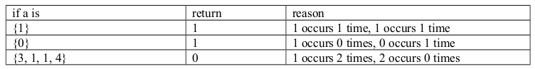

<b>QUESTION 1</b>  
The Stanton measure of an array is computed as follows. Count the number of 1s in the array. Let this count be n. The Stanton measure is the number of times that n appears in the array. For example, the Stanton measure of {1, 4, 3, 2, 1, 2, 3, 2} is 3 because 1 occurs 2 times in the array and 2 occurs 3 times. 

Write a function named stantonMeasure that returns the Stanton measure of its array argument.

<b><u>Example: </u></b>  

----------------------------------------------------------------------------------------------
<b>QUESTION 2</b>  
The sum factor of an array is defined to be the number of times that the sum of the array appears as an element of the array. So the sum factor of {1, -1, 1, -1, 1, -1, 1} is 4 because the sum of the elements of the array is 1 and 1 appears four times in the array. And the sum factor of {1, 2, 3, 4} is 0 because the sum of the elements of the array is 10 and 10 does not occur as an element of the array. The sum factor of the empty array { } is defined to be 0. 

Write a function named sumFactor that returns the sum factor of its array argument.

<b><u>Example: </u></b>  

-----------------------------------------------------------------------------------------------
<b>QUESTION 3</b>  

Consider the following algorithm:
<ul>
<li>Start with a positive number <b>n</b></li>
<li>if n is even then divide by 2</li>
<li>if n is odd then multiply by 3 and add 1</li>
<li>continue this until n becomes 1</li>
</ul>
The <b>Guthrie index</b> of a positive number n is defined to be how many iterations of the above algorithm it takes before n becomes 1.

For example, the Guthrie index of the number 7 is 16 because the following sequence is 16 numbers long. 22, 11, 34, 17, 52, 26, 13, 40, 20, 10, 5, 16, 8, 4, 2, 1
It is easy to see that this sequence was generated by the above algorithm. Since 7 is odd multiply by 3 and add 1 to get 22 which is the first number of the sequence. Since 22 is even, divide by 2 to get 11 which is the second number of the sequence. 11 is odd so multiply by 3 and add 1 to get 34 which is the third number of the sequence and so on.  
Write a function named guthrieIndex which computes the Guthrie index of its argument. Its signature is <b>int guthrieIndex(int n) </b>

 
You may assume that the length of the sequence can be represented by a 32 bit signed integer.

<b><u>Example: </u></b>  
