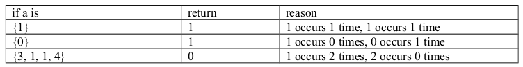
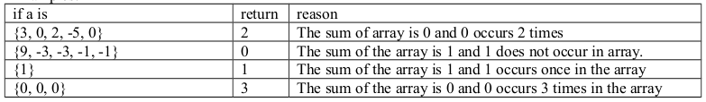

<b>QUESTION 1</b>  
The Stanton measure of an array is computed as follows. Count the number of 1s in the array. Let this count be n. The Stanton measure is the number of times that n appears in the array. For example, the Stanton measure of {1, 4, 3, 2, 1, 2, 3, 2} is 3 because 1 occurs 2 times in the array and 2 occurs 3 times. 

Write a function named stantonMeasure that returns the Stanton measure of its array argument.

<b><u>Example: </u></b>  

----------------------------------------------------------------------------------------------
<b>QUESTION 1</b>  
The sum factor of an array is defined to be the number of times that the sum of the array appears as an element of the array. So the sum factor of {1, -1, 1, -1, 1, -1, 1} is 4 because the sum of the elements of the array is 1 and 1 appears four times in the array. And the sum factor of {1, 2, 3, 4} is 0 because the sum of the elements of the array is 10 and 10 does not occur as an element of the array. The sum factor of the empty array { } is defined to be 0. 

Write a function named sumFactor that returns the sum factor of its array argument.

<b><u>Example: </u></b>  

-----------------------------------------------------------------------------------------------

