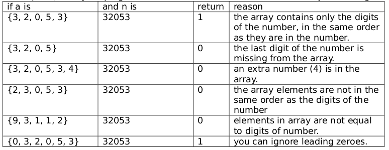
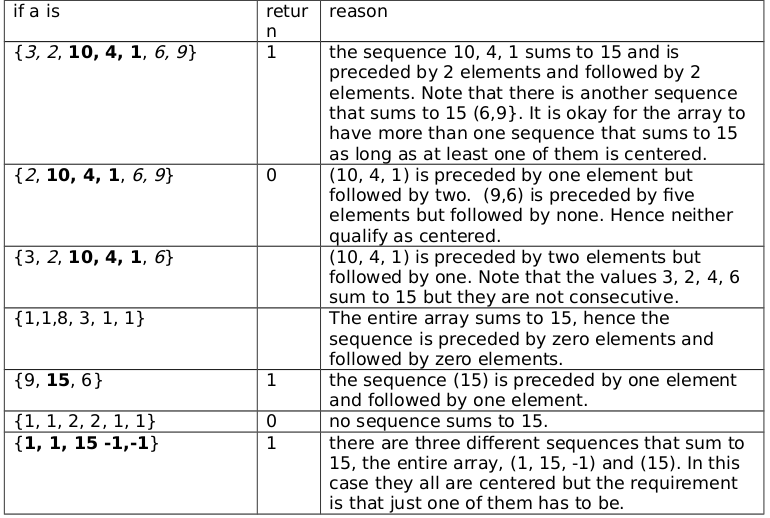

<b>QUESTION 1</b>  
It is a fact that there exist two numbers x and y such that x! + y! = 10!. Write a method
named solve10 that returns the values x and y in an array.
The notation n! is called n factorial and is equal to n * n-1 * n-2 * ... 2 * 1, e.g., 5! = 5*4*3*2*1
= 120.

<b><u>Note: </u></b>  
Please be sure that the method solve10 returns an array, a, with two elements
where a[0] == x, a[1] == y and x! + y! = 10!.

----------------------------------------------------------------------------------------------
<b>QUESTION 2</b>  
An array can hold the digits of a number. For example the digits of the number 32053 are
stored in the array {3, 2, 0, 5, 3}. Write a method call repsEqual that takes an array and aninteger and returns 1 if the array contains only the digits of the number in the same order that they appear in the number. Otherwise it returns 0. 

<b><u>Tests: </u></b>  

-----------------------------------------------------------------------------------------------
<b>QUESTION 3</b>  
An array is called centered-15 if some consecutive sequence of elements of the array sum to
15 and this sequence is preceded and followed by the same number of elements. For example
{3, 2, 10, 4, 1, 6, 9} is centered-15 because the sequence 10, 4, 1 sums to 15 and the
sequence is preceded by two elements (3, 2) and followed by two elements(6,9).
Write a method called isCentered15 that returns 1 if its array argument is centered-15, otherwise it returns 0.

<b><u>Tests: </u></b>  
