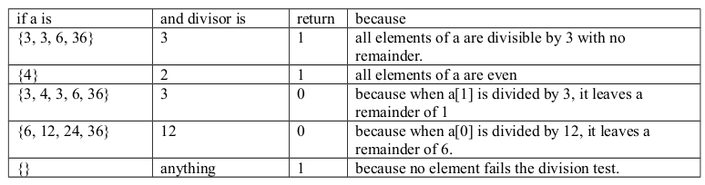
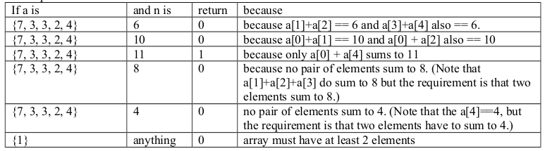

<b>QUESTION 1</b>  
A perfect number is one that is the sum of its factors, excluding itself. The 1st perfect number is 6 because 6 = 1 + 2 + 3. The 2nd perfect number is 28 which equals 1 + 2 + 4 + 7 + 14. The third is 496 = 1 + 2 + 4 + 8 + 16 + 31 + 62 + 124 + 248. In each case, the number is the sum of all its factors excluding itself.  

Write a method named henry that takes two integer arguments, i and j and returns the sum of the ith and jth perfect numbers. So for example, henry (1, 3) should return 502 because 6 is the 1st perfect number and 496 is the 3rd perfect number and 6 + 496 = 502.
 
The function signature is <b>int henry (int i, int j)</b>

<b><u>Note: </u></b>  
You do not have to worry about integer overflow, i.e., you may assume that each sum that you have to compute can be represented as a 31 bit integer. Hint: use modulo arithmetic to determine if one number is a factor of another.

----------------------------------------------------------------------------------------------
<b>QUESTION 2</b>  
Write a method named isDivisible that takes an integer array and a divisor and returns 1 if all its elements are divided by the divisor with no remainder. Otherwise it returns 0.

<b><u>Test Cases: </u></b>  

-----------------------------------------------------------------------------------------------
<b>QUESTION 3</b>  
An array is defined to be n-unique if exactly one pair of its elements sum to n. For example, the array {2, 7, 3, 4} is 5- unique because only a[0] and a[2] sum to 5. But the array {2, 3, 3, 7} is not 5-unique because a[0] + a[1] = 5 and a[0] + a[2] = 5.  

Write a function named isNUnique that returns 1 if its integer array argument is n-unique, otherwise it returns 0. So
<ol>
<li>isNUnique(new int[ ]{2, 7, 3, 4}, 5) should return 1 </li>
<li>isNUnique(new int[] {2, 3, 3, 7}, 5) should return 0 </li>
</ol>
<b><u>Test Cases: </u></b>  

