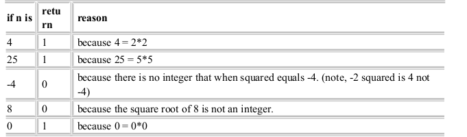

<b>QUESTION 1</b>  
Write a function named isSquare that returns 1 if its integer argument is a square of some integer, otherwise it returns 0. Your function must not use any function or method (e.g. sqrt) that comes with a runtime library or class library!  

The signature of the function is <b> int isSquare(int n)</b>  

<b><u>Test cases: </u></b>  

----------------------------------------------------------------------------------------------
